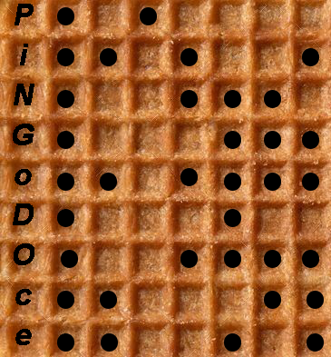

# Cardiac Arrestic Waffle

The given waffle picture is actually a grid with 9 bytes (each square is a bit).

The electrocardiogram can be decoded as bits with an interval of 0.25 seconds, translated as 0 if the heart is not beating and 1 if the heart is beating.

Then, you can use decode the characters using ASCII encoding.

> Flag: `SINFCTF2022{PiNGoDOce}`

## Illustration

