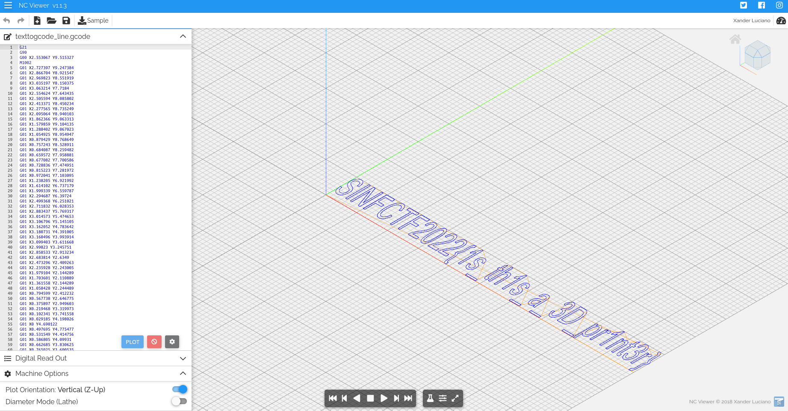

# Weird Format

This is a simple challenge made for people to learn about this file format.
It can be solved by simply opening the given file in a tool like [NCViewer](https://ncviewer.com/).

> Flag: `SINFCTF2022{1s_th1s_a_3D_pr1nt3r}`

## Illustration

## Related Content

https://en.wikipedia.org/wiki/G-code
